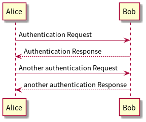
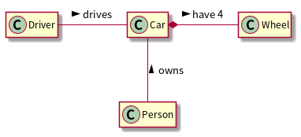

<!-- headingDivider: 1 -->

# <!--fit-->org-mode でスライド書きたい

yewton

# [PlantUML](https://plantuml.com/) を埋め込めるのがデカい

普通に書くと、 `` になるので、 [Marp の機能](https://marpit.marp.app/image-syntax) は使えない。
そのまま表示するだけで事足りる場合はこれでも良い。

# Marp の機能を使いたい場合

<!-- _class: -->

明示的に `eval` してファイル生成だけはしておいて、 `:exports none` にしてエクスポート対象外にする。

その上で、 `@@html:@@` のように参照する。

# org-download との相性も良い

Photo by [Kaboompics .com](https://www.pexels.com/@kaboompics?utm_content=attributionCopyText&utm_medium=referral&utm_source=pexels) from [Pexels](https://www.pexels.com/photo/geometric-decoration-5836/?utm_content=attributionCopyText&utm_medium=referral&utm_source=pexels)

# Marp の機能を使いたい場合

<!-- _class: -->

* PlantUML の場合と同様、 org-mode で画像ファイルリンクを設定すると `` で固定される
* `@@html:@@` のようにインラインHTMLで何とかする

# <!--fit-->終わり

