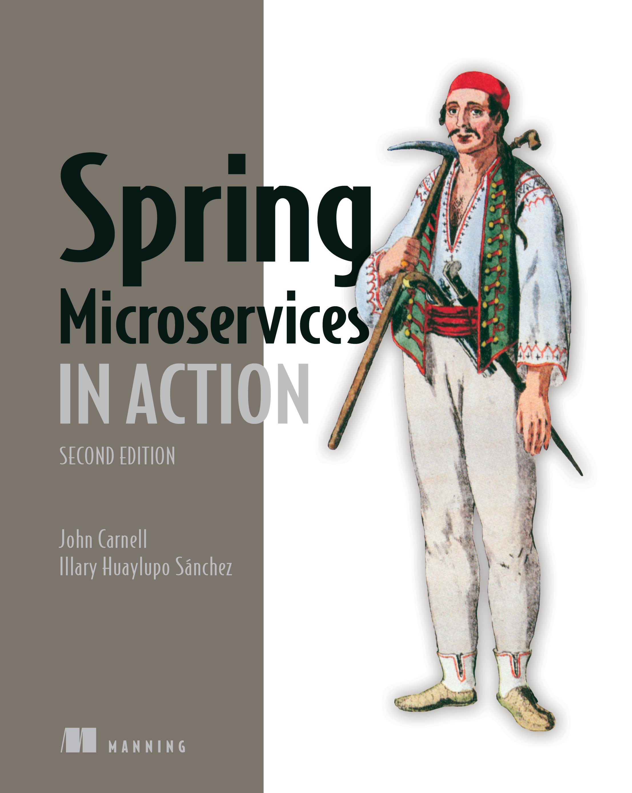
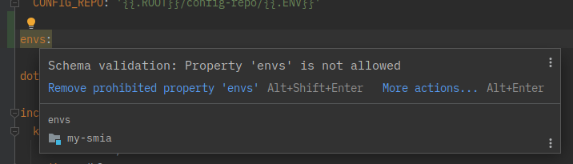

<!-- headingDivider: 1 -->
<style>
@import url('https://fonts.googleapis.com/css2?family=M+PLUS+1p:wght@400;700&display=swap');
section {
    font-family: 'M PLUS 1p', sans-serif;
    color: #595959;
}
section strong {
    color: #292929;
}
img[alt~="center"] {
  display: block;
  margin: 0 auto;
}
</style>


# タスクランナー Task の紹介

yewton

2022 年 11 月 23 日


# 背景

<!--
header: 'タスクランナー Task の紹介'
footer: 'yewton 2022年11月'
-->

---

-   [Spring Microservices in Action, Second Edition](https://amzn.to/3TSpkqM) を独習していた
-   最後の仕上げとして、実際に AWS 上にデプロイしてみよう、という章がある
-   本書ではコンソールから手作業で行う手順のみ示されているが、再現性を高めたかったのと、リソースの消し忘れで課金されるのが怖かったので、極力自動化したかった
-   **シェルの操作を自動化出来る簡易な仕組み** が欲しかった
    -   `GNU Make` の `.PHONY` を代替する何か




# <!--fit-->Task

<https://taskfile.dev/>


---

> Task is a task runner / build tool that aims to be simpler and easier to use than, for example, [GNU Make](https://www.gnu.org/software/make/).


# 推しポイント

1.  環境変数の設定・切り替えが簡単
2.  Go Template が使える
3.  タスクの構造化が簡単・直感的
4.  無駄な実行を防ぐのが簡単
5.  JSON スキーマが公開されており入力支援が効く
6.  その他細かい機能


# 推しポイント

1.  **環境変数の設定・切り替えが簡単**
2.  Go Template が使える
3.  タスクの構造化が簡単・直感的
4.  無駄な実行を防ぐのが簡単
5.  JSON スキーマが公開されており入力支援が効く
6.  その他細かい機能

---

`dotenv` という設定があり、指定したファイルから環境変数を設定することが可能

<https://github.com/yewton/my-smia/blob/main/.env.local> から抜粋した例:

```text
PGDATABASE=ostock_dev
PGHOST=localhost
PGPORT=5432
PGUSER=postgres
```

---

これを以下のように設定することで、設定する環境変数群を切り替えられる:

```yaml
vars:
  ENV: '{{default "local" .ENV}}'
dotenv: [ '.env.{{.ENV}}' ]
```


### 例

普通に実行した場合はローカル用の環境変数が設定される:

```text
task generate:config-files
```

以下のように実行すると AWS 用に切り替わる:

```sh
ENV=aws task generate:config-files
```


# 使用例

<https://github.com/yewton/my-smia> では、ローカル用の `.env` ファイルはべた書きして、 AWS 用は Terraform の `local_file` リソースで生成している。

```terraform
resource "local_file" "env" {
  content         = <<-EOT
  # ...
  DB_HOST = "${module.db.db_instance_address}"
  REDIS_HOST = "${aws_elasticache_cluster.redis.cache_nodes[0].address}"
  # ...
  PGHOST = "${module.db.db_instance_address}"
  PGPORT = "${local.db_port}"
  PGUSER = "${local.db_user}"
  EOT
  filename        = "${local.root_dir}/.env.aws"
  file_permission = "0600"
}
```


# 推しポイント

1.  環境変数の設定・切り替えが簡単
2.  **Go Template が使える**
3.  タスクの構造化が簡単・直感的
4.  無駄な実行を防ぐのが簡単
5.  JSON スキーマが公開されており入力支援が効く
6.  その他細かい機能

---

```yaml
vars:
  ENV: '{{default "local" .ENV}}'
dotenv: [ '.env.{{.ENV}}' ]
```

先程の例でも登場したが [Go Template](https://golang.org/pkg/text/template/) が使える為、条件分岐や整形処理などが柔軟に行える。

Task 独自の仕組みではない為、新たに覚える事が少ない点も嬉しい。


# 使用例


### 環境に応じて実行するコマンドをまるっと変える

```yaml
cmds:
  - |-
    {{if eq .ENV "aws"}}
    aws eks update-kubeconfig --name ostock-dev-cluster --alias ostock-dev-cluster
    {{else}}
    kubectl config use-context docker-desktop
    {{end}}
  - kubectl config set-context --current --namespace={{.NAMESPACE}}
```

<https://github.com/yewton/my-smia/blob/main/k8s/Taskfile.yml>


# 使用例


### 変数の有無に応じて文字列を整形

```yaml
vars:
  IMAGE: '{{with .REGISTRY_HOST}}{{.}}/{{end}}ostock/{{.APP}}:chapter12'
  VALUES_FILE: '{{.APP}}-values.yml'
```

<https://github.com/yewton/my-smia/blob/main/k8s/app/Taskfile.yml>

-   `.REGISTRY_HOST` 無 : `IMAGE: ostock/app:chapter12`
-   `.REGISTRY_HOST` 有 : `IMAGE: host.name/ostock/app:chapter12`


# 推しポイント

1.  環境変数の設定・切り替えが簡単
2.  Go Template が使える
3.  **タスクの構造化が簡単・直感的**
4.  無駄な実行を防ぐのが簡単
5.  JSON スキーマが公開されており入力支援が効く
6.  その他細かい機能


# タスクを入れ子構造に出来る

```text
➜ tree -P 'Taskfile.yml' --prune
.
├── Taskfile.yml
├── apps
│   └── Taskfile.yml
├── docker
│   └── Taskfile.yml
└── k8s
    ├── Taskfile.yml
    ├── app
    │   └── Taskfile.yml
    └── external
        └── Taskfile.yml
```

こんな感じにファイルを配置して…


# タスクを入れ子構造に出来る

```yaml
includes:
  k8s:
    taskfile: ./k8s
    dir: ./k8s
  docker:
    taskfile: ./docker
    dir: ./docker
  apps:
    taskfile: ./apps
    dir: ./apps
```

こんな風に定義すると…

`task *`, `task k8s:*`, `task docker:*`, `task apps:*` のようにタスクを実行出来るようになる

**⇒ タスクの名前空間とファイルを自然な方法で分割管理出来る**


# 複数のタスクを組み合わせられる

```yaml
apply:
  internal: true
  cmds:
    - ytt -f config.yml -f schema.yml --data-value name={{.NAME}} --data-value externalName={{.EXTNAME}} | kubectl apply -f -
  deps:
    - task: :setup
```

こんな感じのタスクを定義しておいて

```yaml
database:
  - task: apply
    vars: { NAME: database, EXTNAME: '{{.DB_HOST}}' }
```

こんな風に利用出来る


# 複数のタスクを組み合わせられる

```yaml
apply:
  internal: true
  cmds:
    - ytt -f config.yml -f schema.yml --data-value name={{.NAME}} --data-value externalName={{.EXTNAME}} | kubectl apply -f -
  deps:
    - task: :setup
```

`deps` で依存タスクを定義出来る。ここで指定されたタスクは並列に実行される。
_( 先頭の `:` は `include` 元のタスクを指定する際に書く )_

```yaml
setup:
  internal: true
  run: once
  deps:
    - task: namespace
```

依存先でもこんな感じで、更に依存先タスクを定義出来たりもする。


# 推しポイント

1.  環境変数の設定・切り替えが簡単
2.  Go Template が使える
3.  タスクの構造化が簡単・直感的
4.  **無駄な実行を防ぐのが簡単**
5.  JSON スキーマが公開されており入力支援が効く
6.  その他細かい機能


# 実行タイミングを制限出来る

```yaml
setup:
  internal: true
  run: once
  deps:
    - task: namespace
```

先程の例でも登場した `run: once` の指定は、一度だけ実行することを示す。

このような「まず最初に一度だけ実行してけおけばよい」的なよくあるケースに簡単に対応出来る。


# 実行条件を指定出来る

```yaml
namespace:
  desc: 名前空間を作成します
  deps:
    - task: use-context
  cmds:
    - kubectl create namespace {{.NAMESPACE}}
  status:
    - kubectl get namespace {{.NAMESPACE}}
```

<https://github.com/yewton/my-smia/blob/main/k8s/Taskfile.yml>

`status` で指定したコマンドの終了ステータスが全て `0` の場合、実行不要と判断され以下のような出力がされる:

```text
task: Task "k8s:namespace" is up to date
```


# 何かを元に何かを生成する場合に対応している

make でよくやるやつ。ただ **make とは違い、指定ファイルのハッシュ値で判断** する(変更時刻で判断するように設定も可能)。

```yaml
generate:config-files:
  desc: 各種設定ファイルを生成します
  vars:
    ENCRYPTED_DB_PASSWORD:
      sh: spring encrypt '{{.DB_PASSWORD}}' --key '{{.ENCRYPT_KEY}}'
    ENCRYPTED_JWT_SIGNING_KEY:
      sh: spring encrypt '{{.JWT_SIGNING_KEY}}' --key '{{.ENCRYPT_KEY}}'
  cmds:
    # 中略
  sources:
    - '.env.{{.ENV}}'
  generates:
    - '{{.SECRET_FILE}}'
    - '{{.CONFIG_REPO}}/*.yml'
```


# 推しポイント

1.  環境変数の設定・切り替えが簡単
2.  Go Template が使える
3.  タスクの構造化が簡単・直感的
4.  無駄な実行を防ぐのが簡単
5.  **JSON スキーマが公開されており入力支援が効く**
6.  その他細かい機能

---



[JSON Schema Store](https://www.schemastore.org/json/) に公式のスキーマ定義がある為、対応している IDE やエディタであれば、入力補完やミスの指摘をしてくれる。

<https://github.com/SchemaStore/schemastore/blob/master/src/schemas/json/taskfile.json>

IntelliJ IDEA なら Ultimate 版でこの機能が使える。

<https://www.jetbrains.com/help/idea/json.html#ws_json_using_schemas>


# 推しポイント

1.  環境変数の設定・切り替えが簡単
2.  Go Template が使える
3.  タスクの構造化が簡単・直感的
4.  無駄な実行を防ぐのが簡単
5.  JSON スキーマが公開されており入力支援が効く
6.  **その他細かい機能**

---

-   `silent`
    -   通常は実行するコマンドが画面に出力されるが、それを抑制出来る
    -   機微な情報を画面に出力させたくない場合に便利
-   `internal`
    -   ユーザーに公開していない内部的なタスクであることを示す
    -   タスク一覧( `task -l` )されなくなる他、実行しようとしてもエラーになる
        -   こんなエラー: `task: Task "docker:ecr:push" is internal`
-   コマンドライン引数を扱える
    -   `{{.CLI_ARGS}}` にコマンドライン引数が設定される
    -   環境変数以外でも変数を渡せるということでちょっと便利
        -   実行例: `task apps:build-image -- config-server`


# 惜しいポイント


## 変数の遅延評価や都度評価は(今の所)無い

-   タスク変数は呼び出し時に、グローバル変数は最初に、それぞれ評価される
-   グローバル変数に重い処理を書くと、実行時に毎回待たされることになる
-   一度評価された変数は二度と評価されず、都度評価したいケースには未対応


### 対応予定？

次期バージョン v4 のスコープには入っていそう…
ただし、リリース時期は不明

<https://github.com/go-task/task/issues/703>


# <!--fit-->Task

<https://taskfile.dev/>


---

YAML テンプレーティングツール ytt も便利だったので
その内紹介したい

<https://carvel.dev/ytt/docs/latest/>

使用例は <https://github.com/yewton/my-smia/tree/main/k8s> 辺りにあります


# <!--fit-->終わり
